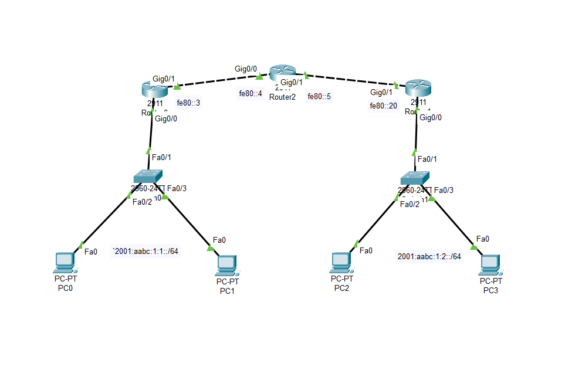

# OSPFv3 Configuration - IPv6 Dynamic Routing

<div align="center">



*OSPFv3 Dynamic Routing Protocol for IPv6 Networks*

[](https://www.netacad.com/courses/packet-tracer)
[](https://github.com)
[](https://github.com)

</div>

---

## 📋 Project Overview

This project demonstrates **OSPFv3 (OSPF for IPv6)** implementation using Cisco routers. OSPFv3 is a link-state dynamic routing protocol designed specifically for IPv6 networks, providing automatic route discovery, fast convergence, and scalable routing for enterprise environments.

## 🏗️ Network Architecture


### Topology Structure

```
        ┌─────────┐         ┌─────────┐         ┌─────────┐
        │ Router0 │─────────│ Router2 │─────────│ Router1 │
        │  2911   │ Gig0/0  │  2911   │ Gig0/1  │  2911   │
        └────┬────┘         └─────────┘         └────┬────┘
             │                                        │
        Gig0/0 Fa0/1                            Gig0/0 Fa0/1
             │                                        │
        ┌────┴────┐                            ┌─────┴─────┐
        │ Switch  │                            │  Switch   │
        │2960-24TT│                            │ 2960-24TT │
        └────┬────┘                            └─────┬─────┘
             │                                       │
        ┌────┴────┐                            ┌────┴─────┐
        │         │                            │          │
      PC0       PC1                          PC2        PC3
```

### Network Topology Details

**Backbone (WAN Links):**
- Router0 ↔ Router2: `fe80::4` / `fe80::5` (Gig0/0 ↔ Gig0/1)
- Router2 ↔ Router1: `fe80::5` / `fe80::20` (Gig0/1 ↔ Gig0/1)

**LAN Segments:**
- **Left Network** (Router0): `2001:aabc:1:1::/64`
- **Right Network** (Router1): `2001:aabc:1:2::/64`

## 🖥️ Network Devices

### Routers
- **3x Cisco 2911 Routers**
  - Router0 (Left edge)
  - Router2 (Core/center)
  - Router1 (Right edge)

### Switches
- **2x Cisco 2960-24TT Switches**
  - Switch (Left) - connects PC0, PC1
  - Switch (Right) - connects PC2, PC3

### End Devices
- **4x PC-PT**
  - PC0, PC1 (Left subnet: `2001:aabc:1:1::/64`)
  - PC2, PC3 (Right subnet: `2001:aabc:1:2::/64`)

## 📊 IPv6 Addressing Scheme

### Subnet Allocation

| Network | IPv6 Address | Router Interface | Connected Devices |
|---------|--------------|------------------|-------------------|
| **Left LAN** | `2001:aabc:1:1::/64` | Router0 Fa0/1 | PC0, PC1 |
| **Right LAN** | `2001:aabc:1:2::/64` | Router1 Fa0/1 | PC2, PC3 |
| **WAN Link 1** | Link-Local | Router0 Gig0/0 ↔ Router2 Gig0/0 | - |
| **WAN Link 2** | Link-Local | Router2 Gig0/1 ↔ Router1 Gig0/1 | - |

### Router Interface Addressing

#### Router0 (Left)
- **Gig0/0**: Link-local `fe80::4` (to Router2)
- **Fa0/1**: `2001:aabc:1:1::1/64` (LAN gateway)

#### Router2 (Core)
- **Gig0/0**: Link-local `fe80::5` (to Router0)
- **Gig0/1**: Link-local `fe80::5` (to Router1)

#### Router1 (Right)
- **Gig0/1**: Link-local `fe80::20` (to Router2)
- **Fa0/1**: `2001:aabc:1:2::1/64` (LAN gateway)

## 🔧 OSPFv3 Implementation

### What is OSPFv3?

**OSPFv3** is the IPv6-specific version of the OSPF (Open Shortest Path First) routing protocol. Unlike OSPFv2 (for IPv4), OSPFv3 runs directly over IPv6 and uses link-local addresses for neighbor relationships.

#### Key Features:
- ✅ Link-state routing protocol
- ✅ Fast convergence (sub-second)
- ✅ Automatic route discovery
- ✅ Hierarchical design with areas
- ✅ Supports multiple IPv6 subnets
- ✅ Loop-free routing
- ✅ Load balancing support

#### OSPFv3 vs OSPFv2:

| Feature | OSPFv2 (IPv4) | OSPFv3 (IPv6) |
|---------|---------------|---------------|
| Address Family | IPv4 | IPv6 |
| Neighbor Discovery | IPv4 addresses | Link-local addresses |
| Authentication | Built-in | IPsec |
| Configuration | Under network command | Per-interface |
| LSA Types | 11 types | New IPv6-specific types |

## 🚀 Configuration Guide

### Router0 Configuration

```cisco
Router0> enable
Router0# configure terminal

! Enable IPv6 routing
Router0(config)# ipv6 unicast-routing

! Configure LAN interface
Router0(config)# interface FastEthernet0/1
Router0(config-if)# ipv6 address 2001:aabc:1:1::1/64
Router0(config-if)# ipv6 enable
Router0(config-if)# ipv6 ospf 1 area 0
Router0(config-if)# no shutdown
Router0(config-if)# exit

! Configure WAN interface
Router0(config)# interface GigabitEthernet0/0
Router0(config-if)# ipv6 enable
Router0(config-if)# ipv6 ospf 1 area 0
Router0(config-if)# no shutdown
Router0(config-if)# exit

! Enable OSPFv3 process
Router0(config)# ipv6 router ospf 1
Router0(config-rtr)# router-id 1.1.1.1
Router0(config-rtr)# exit

Router0(config)# exit
Router0# write memory
```

### Router2 Configuration (Core)

```cisco
Router2> enable
Router2# configure terminal

! Enable IPv6 routing
Router2(config)# ipv6 unicast-routing

! Configure WAN interface to Router0
Router2(config)# interface GigabitEthernet0/0
Router2(config-if)# ipv6 enable
Router2(config-if)# ipv6 ospf 1 area 0
Router2(config-if)# no shutdown
Router2(config-if)# exit

! Configure WAN interface to Router1
Router2(config)# interface GigabitEthernet0/1
Router2(config-if)# ipv6 enable
Router2(config-if)# ipv6 ospf 1 area 0
Router2(config-if)# no shutdown
Router2(config-if)# exit

! Enable OSPFv3 process
Router2(config)# ipv6 router ospf 1
Router2(config-rtr)# router-id 2.2.2.2
Router2(config-rtr)# exit

Router2(config)# exit
Router2# write memory
```

### Router1 Configuration

```cisco
Router1> enable
Router1# configure terminal

! Enable IPv6 routing
Router1(config)# ipv6 unicast-routing

! Configure LAN interface
Router1(config)# interface FastEthernet0/1
Router1(config-if)# ipv6 address 2001:aabc:1:2::1/64
Router1(config-if)# ipv6 enable
Router1(config-if)# ipv6 ospf 1 area 0
Router1(config-if)# no shutdown
Router1(config-if)# exit

! Configure WAN interface
Router1(config)# interface GigabitEthernet0/1
Router1(config-if)# ipv6 enable
Router1(config-if)# ipv6 ospf 1 area 0
Router1(config-if)# no shutdown
Router1(config-if)# exit

! Enable OSPFv3 process
Router1(config)# ipv6 router ospf 1
Router1(config-rtr)# router-id 3.3.3.3
Router1(config-rtr)# exit

Router1(config)# exit
Router1# write memory
```

### PC Configuration

Configure PCs to use **IPv6 Auto Configuration** or manually assign:

**PC0/PC1 (Left Network):**
- IPv6 Address: Auto-configure from `2001:aabc:1:1::/64`
- Default Gateway: `2001:aabc:1:1::1`

**PC2/PC3 (Right Network):**
- IPv6 Address: Auto-configure from `2001:aabc:1:2::/64`
- Default Gateway: `2001:aabc:1:2::1`

## 🧪 Testing & Verification

### Verification Commands

#### Check OSPFv3 Neighbors
```cisco
Router# show ipv6 ospf neighbor

Expected output:
Neighbor ID     Pri   State      Dead Time   Interface ID    Interface
2.2.2.2          1    FULL/DR    00:00:35    5               GigabitEthernet0/0
```

#### Verify OSPFv3 Routes
```cisco
Router# show ipv6 route ospf

O   2001:aabc:1:2::/64 [110/2]
     via FE80::5, GigabitEthernet0/0
```

#### Check OSPFv3 Interface Status
```cisco
Router# show ipv6 ospf interface brief

Interface    PID   Area            Intf ID    Cost  State Nbrs F/C
Fa0/1        1     0               3          1     DR    0/0
Gi0/0        1     0               4          1     BDR   1/1
```

#### Verify OSPFv3 Database
```cisco
Router# show ipv6 ospf database
```

### Connectivity Tests

#### From PC0 to PC3 (Cross-subnet):
```bash
ping 2001:aabc:1:2::3
tracert 2001:aabc:1:2::3
```

#### Expected Results:
- ✅ OSPF neighbors form (FULL state)
- ✅ Routes learned via OSPFv3 (marked with 'O')
- ✅ End-to-end connectivity between all PCs
- ✅ Packets route through Router2 (core)

## 📚 How OSPFv3 Works

### 1. Neighbor Discovery
- Routers send Hello packets on multicast `FF02::5`
- Use link-local addresses for neighbor relationships
- Form adjacencies with directly connected OSPF routers

### 2. Link-State Advertisement (LSA)
- Routers flood LSAs to share topology information
- Each router builds identical link-state database (LSDB)
- LSAs include network prefixes and link costs

### 3. SPF Calculation
- Dijkstra's algorithm calculates shortest path
- Creates loop-free routing topology
- Best routes installed in routing table

### 4. Route Convergence
- Network changes trigger LSA updates
- Fast reconvergence (typically < 1 second)
- Alternate paths automatically activated

## 🎯 Learning Objectives

This topology demonstrates:
- OSPFv3 configuration for IPv6
- Link-state routing protocol operation
- Multi-router IPv6 network design
- Dynamic route advertisement
- OSPF neighbor relationships
- Link-local addressing in routing
- Network convergence and failover

## 📁 Project Files

```
ospfv3-ipv6-configuration/
├── assets/
│   ├── cisco.pkt          # Packet Tracer file
│   ├── topology.png       # Network diagram
│   ├── R0.png            # Router0 configuration
│   ├── R1.png            # Router1 configuration
│   └── R2.png            # Router2 configuration
└── README.md              # This file
```

## 🔍 Troubleshooting

### Common Issues

**OSPF neighbors not forming**
- ✅ Check `ipv6 unicast-routing` is enabled
- ✅ Verify `ipv6 ospf 1 area 0` on both interfaces
- ✅ Confirm interfaces are up/up
- ✅ Check if hello/dead timers match
- ✅ Verify no ACLs blocking multicast FF02::5

**Routes not appearing**
- ✅ Confirm OSPF neighbors in FULL state
- ✅ Check OSPF process is running
- ✅ Verify area IDs match
- ✅ Review `show ipv6 ospf database`

**Cannot ping across subnets**
- ✅ Verify routing table has remote networks
- ✅ Check gateway configuration on PCs
- ✅ Confirm IPv6 forwarding is enabled
- ✅ Test connectivity hop-by-hop

**Link-local address issues**
- ✅ Use `ipv6 enable` on interfaces
- ✅ Verify link-local addresses exist (`show ipv6 interface`)
- ✅ Ensure physical layer is up

## 🆚 Comparison with Other Protocols

| Feature | OSPFv3 | RIPng | EIGRP for IPv6 |
|---------|--------|-------|----------------|
| Type | Link-state | Distance-vector | Advanced DV |
| Convergence | Fast | Slow | Fast |
| Scalability | High | Low | Medium-High |
| Metric | Cost | Hop count | Composite |
| Standard | Open | Open | Cisco proprietary |

## 🎓 Key Concepts

### OSPFv3 Areas
- **Area 0 (Backbone)**: All areas must connect to Area 0
- **Stub Areas**: Reduce routing table size
- **Totally Stubby**: Further optimization

### OSPF Router Types
- **Internal Router**: All interfaces in same area
- **Backbone Router**: Interface in Area 0
- **ABR (Area Border Router)**: Connects multiple areas
- **ASBR**: Redistributes external routes

### LSA Types in OSPFv3
- **Type 1**: Router LSA
- **Type 2**: Network LSA
- **Type 3**: Inter-Area Prefix LSA
- **Type 9**: Link LSA (OSPFv3 specific)

## 🛠️ Prerequisites

- Cisco Packet Tracer 7.x or newer
- Understanding of IPv6 addressing
- Basic knowledge of routing protocols
- Familiarity with Cisco IOS commands

## 👥 Author

**renaiy0** - Network Engineer

## 📝 License

This project is for educational purposes.

---

<div align="center">

</div>
